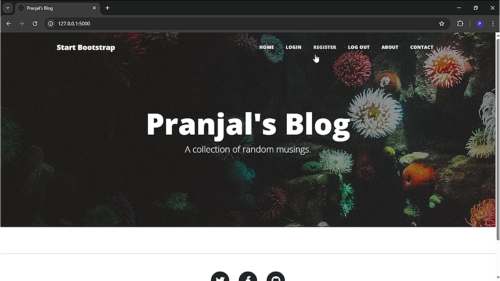

# Blog Project Advanced
This **Flask blog application** allows users to register, log in, and create blog posts. It includes **Home, About, and Contact pages**, where users can contact the blogger via email. The project uses a database with **User, BlogPost, and Comment tables**, establishing necessary relationships. Only the **first registered user (admin)** can perform CRUD operations on blog posts. All users can **comment on posts**, and flash messages provide feedback on errors like incorrect login details.  

## Video
[](https://www.google.com/)

## Author
Pranjal Sarnaik

## Features
- **User Authentication**: Register, log in, and log out securely.  
- **Admin Controls**: Only the first registered user can add, edit, or delete blog posts.  
- **Commenting System**: Users can comment on blog posts.  
- **Email Contact Form**: Users can send messages to the blogger.  
- **Flash Messages**: Displays validation errors and login feedback.  

## Level
Advanced

## Tech Stack
Flask | SQLAlchemy | Flask-Login | Flask-Bootstrap | Flask-CKEditor | Flask-Gravatar | WTForms | SQLite | Web Development | Python

## How to Run
1. Clone the repo:  
   ```bash  
   git clone https://github.com/pranjalco/flask-blog-project.git

2. Install dependencies and run: 
    ```bash
   pip install -r requirements.txt
   pip install -r requirements_3.12.txt
   python main.py
   ```
**Created by Pranjal Sarnaik**  
*Released under the MIT License*